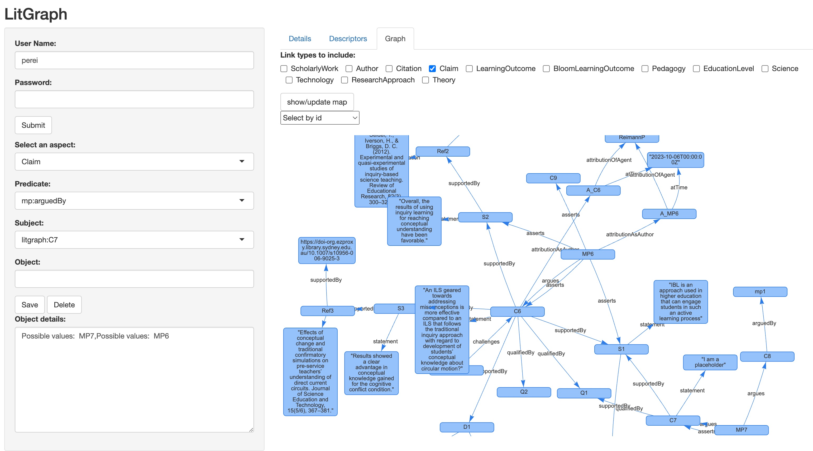

# LitNet - the 'living' review as Knowledge Graph

LitNet is a method for literature review that is inspired by the idea of the [living evidence synthesis](https://www.statnews.com/2023/03/27/strengthen-science-by-funding-living-evidence-synthesis/): Keeping the bibliographic materials up-to-date even after the literature review has been (or is being) reviewed and published. To this end, bibliographic references and all the data needed to create tables and graphics for a research synthesis are kept separate from the text. For printing or publishing the review, the text and the data get combined on demand, using the [quarto](https://quarto.org/) publishing system. Thus, the document reflects any changes (updates) in the data.

The second main concept is the *semantic literature review*: LitNet builds on RDF and SKOS--semantic web standards--and uses a RDF database. Semantic methods allow to express more complex relations than attribute-value pairs and can do so more easily than using relational databases. In effect, LitNet expresses bibliographic and coded information as a [Knowledge Graph](https://en.wikipedia.org/wiki/Knowledge_graph).

LitNet is a good fit with theory-oriented approaches to literature review and research synthesis, in particular the [Realist Review](https://en.wikipedia.org/wiki/Realist_Evaluation). For instance, in LitNet [theories of behavior change](https://www.humanbehaviourchange.org/bcio) can be modeled and set in relation to (parts of) published studies. In the near future, LitNet will also include the modeling of provenance via the [provo ontology](<https://www.w3.org/TR/prov-o/>). This is important for increasing the transparency of qualitative review methods.

In terms of tool support, LitNet can be used in three modes:

1.  'low-tech mode': All data (bibliographic references, code books) are kept in local files and get combined with text into a up-to-date document.
2.  'medium-tech mode': The data are kept in a (local or web) database and get combined with text into a up-to-date document. This makes it easier to collaborate for keeping the data up–to-date.
3.  'high-tech mode': The data are kept on a web server and the access to the report is interactive. In other words, the report (more specifically, the report data) takes the form of a web application. This makes it easier to dynamically adopt to information user needs and preferences.

For both (1) and (2), the report can be automatically generated in different formats: Word document, PDF, HTML (including a static website), thanks to quarto.

The core of (3) is a R Shiny application with a point-and-click interface to enter study descriptions and codes. The app provides some basic visualisation capabilities and facilitates data entry.



Because LitNet is built around common web standards and mainly with open-source tools, there is little risk of lock-in. Even the (commercial) database server[^readme-1] can be run for free on a local computer.

[^readme-1]: I am using [AllegroGraph](https://allegrograph.com/) that is free for up to 5 Million statements. But any graph server could be used, including the open source ones such as Virtuoso and Apache Fuseki.

## Purpose

The main use case is preparing an analytic literature review or research synthesis (used synonymously). The reviewer attaches codes to publications (or parts of publications) and inditifies relations between (parts of) publications. An example for a code is the age group of the human participants in a learning research study. An example for a relation between two studies is that S1 cites S2. Another example for a relational annotation is that S1 contains a claim C.

Reviewers can enter codes and relations by editing plain text files and/or using the web app. The app's particular feature is that it can import any coding scheme written in SKOS notation with very few manual adjustments needed.

The main purpose of the Shiny app is to facilitate the entry of RDF data. It automatically offers values for codes in dropdown boxes and fills in namespaces needed for fully formatted RDF. This makes it comparatively easy to create--or contribute to--a Knowledge Graph that contains the bibliographic data and the thematic codes and relations for the tables and graphs that appear in published literature reviews.

As an example, the app is set up with bibliographic data and SKOS concept schemes from a review on computational models and simulations in environmental education. Some domain-specific concept schemes are general in nature: those for education levels, areas of research codes, and Bloom's Taxonomy.

## Main steps

In a typical use scenario, an administrator would set up the database and represent the coding book in SKOS; the researcher would then use the web app for data entry and coding. Bibliographic data can be imported in bulk as long as it is encoded in formats such as BibTeX or RIS.

The main steps (the ones specific to this method in bold) for the researcher are:

1.  Formulate research questions.
2.  Conduct literature searches.
3.  Filter studies according to criteria.
4.  **Save bibliographic data in the RDF format.**
5.  **Select/Develop controlled vocabularies for one-tuple relations p(x) and express them in SKOS.**
6.  **Select/Develop controlled vocabularies for two-tuple relations p(x,y).**
7.  **Code the studies employing the controlled vocabularies. Either by authoring a text document and/or by using the litGraph app.**
8.  **Visualise relations using the app.**
9.  Create frequency tables and graphs either with spreadsheet or statistics programs **or by running queries on the database that sits behind the app**.
10. Write the review/synthesis paper and **make accessible the coding information as linked data via the database (as a SPARQL endpoint) and/or by 'publishing' the app.**

## RDF data representation

### Ontologies

Re-used ontologies:

-   [bibo](http://purl.org/ontology/bibo/) for bibiographic detail
-   [dcterms](http://purl.org/dc/terms/) for general meta-data
-   [foaf](http://xmlns.com/foaf/0.1/) for people and organisations
-   [skos](http://www.w3.org/2004/02/skos/core#) for controlled vocabularies (thematic codes) and nomenclature
-   [prov](http://www.w3.org/ns/prov#) for provenance
-   [mp](https://doi.org/10.1186/2041-1480-5-28) for micropublications (claims)
-   [theo](https://www.nature.com/articles/s41562-019-0561-2) for theoretical statements

Method- and application specific:

-   [litrev](http://www-learnweb.com/2023/litrev/) for application-specific predicates

### SKOS concept schemes:

The SKOS Simple Knowledge Organization System is a [W3C standard](https://www.w3.org/2004/02/skos/) for the description of thesauri and taxonomies. It is used here to describe the vocabulary for coding research works along various dimensions. Each concept scheme has its own namespace:

-   [sci](https://github.com/prei007/litrev/blob/main/thesauri/ScienceThesaurus.skos.ttl) for science domains
-   [bloom](https://github.com/prei007/litrev/blob/main/thesauri/BloomThesaurus.skos.ttl) Bloom's Taxonomy of learning outcomes
-   [edlevel](https://github.com/prei007/litrev/blob/main/thesauri/EducationLevel.skos.ttl) for education level (e.g., highschool)
-   [lo](https://github.com/prei007/litrev/blob/main/thesauri/OutcomesThesaurus.skos.ttl) for learning outcomes specific to environmental education
-   [rm](https://github.com/prei007/litrev/blob/main/thesauri/MethodsThesaurus.skos.ttl) for research methods
-   [envped](https://github.com/prei007/litrev/blob/main/thesauri/PedagogyThesaurus.skos.ttl) for pedagogies
-   [tech](https://github.com/prei007/litrev/blob/main/thesauri/EdTechThesaurus.skos.ttl) for technologies

The first three taxonomies are independent of the reviewed domain and can be re-used for other reviews. If a coding nomenclature is described in SKOS it can easily be added to the app.

## Files

The files are organised into four folders:

**application:** R and Shiny code, see Section 'The Shiny app' below

**models:** This folder contains optionally the input and output of coding as static files. It is up to the user if model files exist outside of the database content. This would be the place to store manually coded information for cases where the database (and app) are not used.

**ontologies:** Contains the OWL or RDFS ontologies used in the method and the app. This is optional information, and it is also optional to load the ontologies into the database or not. The former is recommended for any reasoning task to be performed on the database and for making ontological information available to the database users.

### Thesauri

This is the folder for storing SKOS thesauri. To use a thesaurus in the app, the following needs to be specified in the respective files.

The thesauri can be used for coding by creating models that are stored in files. They also play an important role when using the app. The app uses information from a thesaurus file to offer suggestions to the app user as to (a) which coding schemes are available and (b) what the concepts in each scheme are. If the concept definitions include `skos:broader` relations, these will be used to display the concepts for selection in the app. The app also uses labels, definitions etc., if available.

Using Bloom's Taxonomy in the file `BloomThesaurus.skos.ttl` as the example, the following information must be provided:

1.  Namespace and prefixes:

```         
PREFIX : <http://www.learn-web.com/thesauri/bloom_outcomes/>  
PREFIX bloom: <http://www.learn-web.com/thesauri/bloom_outcomes/>
PREFIX skos: <http://www.w3.org/2004/02/skos/core#>
```

These must correspond to the `prefix` and `uri` columns in the file `predicates.csv` (and the variable `predicates` once the csv file is loaded into the app). The file `predicates.csv` is located in the folder `application` because the application reads in this file when initialising. (see below, "Preparing the app", for more information about `predicates.csv`.)

2.  A single `skos:ConceptScheme`, the name of which needs to correspond with the one in the column `skos` in the file `predictes.csv`. For instance, in the Bloom taxonomy we find this definition:

```         
:BloomThesaurus a skos:ConceptScheme ; 
  rdfs:label "Bloom learning outcomes" ;
    dc:title "Bloom learning outcomes " ;
    skos:hasTopConcept :CognitiveOutcome, :AffectiveOutcome, :PsychomotorOutcome .
```

Only the first line is required, the other properties are optional.

3.  Each concept in the thesaurus should be member of the ConceptScheme. For instance:

```         
:CognitiveOutcome a skos:Concept ; 
    skos:inScheme :BloomThesaurus ; 
    skos:prefLabel "Cognitive learning outcome"@en . 
```

## Database

Use of the database is optional. It is required if one wants to use the app as the app functions a client to the database. For most users, it will be a black box, with only an administrator being concerned with it.

### Initializing the DB

The database needs to contain at least one coding scheme. Typically, one would also import the bibliographic data before using the method or the app because it is tedious to enter such data by hand. But this is not required to get started.

A user with r/w rights on the database uploads skos files and whatver bibliographic information is available in RDF format into the database. This step is not covered here as it usually done by the database administrator.

## The Shiny app

### Preparing the app

The app gets information about the predicates to offer to the user in form of a table `predicates` and in form of files with SKOS concept schemes (see above, "Thesauri").

#### Information in the file predicates.csv

Each predicate needs to have a row in the spreadsheet. The attributes (columns) for each predicate are:

-   label: the predicate name, including the prefix. For instance, `foaf:name`, `cito:cites`.
-   aspect: The aspect bundles predicates into logical groups. For instance, `Author`, `Citation`.
-   domain: The predicates domain (the kinds of resources it applies to), in prefix notation. (Note: Only one domain per predicate)
-   range: The kind of values the predicate can take. For instance `xsd:string` for literals, `bibo:Article` for scholarly works. A special case is where the value range should come from a SKOS thesaurus. In that case, range = `Thesaurus`. (Note: Only one range per predicate).
-   skos: If the range has value `Thesaurus`, then provide here the name of the skos:ConceptScheme that delivers the values for the predicate; keep empty otherwise.
-   prefix: The prefix for the predicate's namespace
-   uri: The URI for the predicate's namespace.

Note that prefix and URI have to correspond to the predicate label, and the prefixes and URIs for SKOS thesauri need to correspond with the information in the file with the thesaurus definitions. See "Thesauri" above.

### Using the app

Video will be provided soon.
